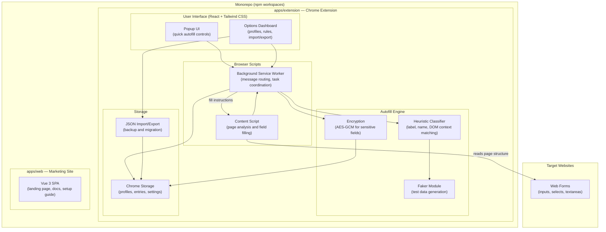

# C3 Autofill - System Architecture

**A browser-first form automation platform focused on secure local autofill**

---

## High-Level Architecture

---

## Component Breakdown

### 1. Popup UI

| Aspect | Detail |
| :--- | :--- |
| **Purpose** | Fast access to autofill actions on the current page |
| **Tech** | React 19, TypeScript, Tailwind CSS |
| **User Flow** | Review active profile, trigger fill, search and manage keys |
| **Entry Point** | `apps/extension/src/popup/index.html` (Vite multi-entry) |

### 2. Content Script

| Aspect | Detail |
| :--- | :--- |
| **Purpose** | Inspect the current page and fill form fields |
| **Signals** | Labels, placeholders, input names, nearby text, form grouping |
| **Behavior** | Receives fill instructions from background, applies values in-page |
| **Build** | Separate Vite build (`vite.content.config.ts`) producing a single `content.js` |

### 3. Options Dashboard

| Aspect | Detail |
| :--- | :--- |
| **Purpose** | Manage profiles, form entries, faker data, and extension settings |
| **Tabs** | Entries, Settings, Faker Data, Advanced (import/export/delete) |
| **Entry Point** | `apps/extension/src/options/index.html` (Vite multi-entry) |

### 4. Background Service Worker

| Aspect | Detail |
| :--- | :--- |
| **Purpose** | Coordinate popup, options, and content script messaging |
| **Responsibilities** | Profile loading, storage access, active profile tracking |
| **Security** | Keeps privileged extension actions isolated from page context |

### 5. Heuristic Field Classifier

| Aspect | Detail |
| :--- | :--- |
| **Purpose** | Detect and classify form fields by analyzing DOM context |
| **Location** | `apps/extension/src/services/classifier/` |
| **Strategy** | Factory pattern with pluggable classifier implementations |

### 6. Local Data Layer

| Aspect | Detail |
| :--- | :--- |
| **Storage** | Chrome extension local storage (`chrome.storage.local`) |
| **Contents** | Profiles, form entries, settings, faker categories |
| **Encryption** | AES-GCM encryption for sensitive field values |
| **Privacy** | All user data remains local to the browser |

---

## Tech Stack

| Layer | Technologies |
| :--- | :--- |
| **Extension Runtime** | Chrome Extension Manifest V3 |
| **UI Framework** | React 19, TypeScript 5.7 |
| **Styling** | Tailwind CSS 4, FontAwesome 6 |
| **Build Tool** | Vite 6 (multi-entry: popup, options, background + separate content script) |
| **Monorepo** | npm workspaces |
| **Marketing Site** | Vue 3, Pinia, Vue Router, Vite |
| **Persistence** | Chrome Storage APIs |
| **Encryption** | Web Crypto API (AES-GCM) |
| **Portability** | JSON import/export |
| **Platforms** | Chromium-based browsers |

---

## Security Model

- **Local Data First** — user autofill data is stored locally, never sent to a backend.
- **AES-GCM Encryption** — sensitive field values (passwords, SSN, credit cards) are encrypted at rest using the Web Crypto API.
- **Extension Isolation** — page scripts cannot access privileged extension storage.
- **Controlled Filling** — fill operations run through extension logic with configurable field sensitivity controls.
- **Portable Backups** — JSON export enables migration without requiring a cloud account.
- **Sensitive Field Controls** — granular toggles for security, finance, and identity field categories.

---

[Back to Organization Profile](../../profile/README.md)

