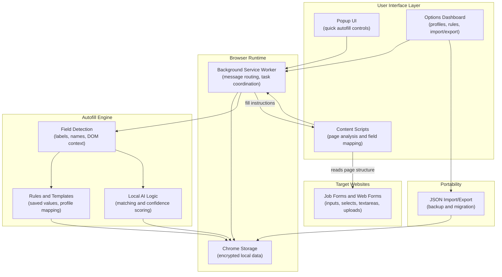

# C3 Autofill - System Architecture

**A browser-first form automation platform focused on secure local autofill**

---

## High-Level Architecture

---

## Component Breakdown

### 1. Popup UI

| Aspect | Detail |
| :--- | :--- |
| **Purpose** | Fast access to autofill actions on the current page |
| **User Flow** | Review profile, trigger fill, inspect detected fields |
| **Scope** | Lightweight controls intended for in-page productivity |

### 2. Content Scripts

| Aspect | Detail |
| :--- | :--- |
| **Purpose** | Inspect the current page and identify fillable fields |
| **Signals** | Labels, placeholders, input names, nearby text, form grouping |
| **Behavior** | Maps saved data to fields and applies values in-page |

### 3. Options Dashboard

| Aspect | Detail |
| :--- | :--- |
| **Purpose** | Manage saved profiles, autofill rules, and extension settings |
| **Data Tools** | JSON import/export for backup and transfer |
| **Configuration** | Field mappings, user preferences, site-specific behavior |

### 4. Background Service Worker

| Aspect | Detail |
| :--- | :--- |
| **Purpose** | Coordinate popup, options, and content script messaging |
| **Responsibilities** | State loading, storage access, task orchestration |
| **Security** | Keeps privileged extension actions out of page context |

### 5. Local Data Layer

| Aspect | Detail |
| :--- | :--- |
| **Storage** | Chrome extension local storage |
| **Contents** | Profiles, rules, preferences, import/export payloads |
| **Privacy Model** | User data remains local to the browser environment |

---

## Tech Stack

| Layer | Technologies |
| :--- | :--- |
| **Extension Runtime** | Chrome Extension Manifest V3 |
| **Frontend** | HTML, CSS, JavaScript |
| **Execution Model** | Popup UI, options page, content scripts, background worker |
| **Persistence** | Chrome storage APIs |
| **Portability** | JSON import/export |
| **Platforms** | Chromium-based browsers |

---

## Security Model

- **Local Data First** - user autofill data is stored locally rather than in a hosted backend.
- **Extension Isolation** - page scripts do not get direct access to privileged extension storage.
- **Controlled Filling** - fill operations run through extension logic instead of arbitrary page automation.
- **Portable Backups** - JSON export enables migration without requiring a cloud account.

---

[Back to Organization Profile](../../profile/README.md)

