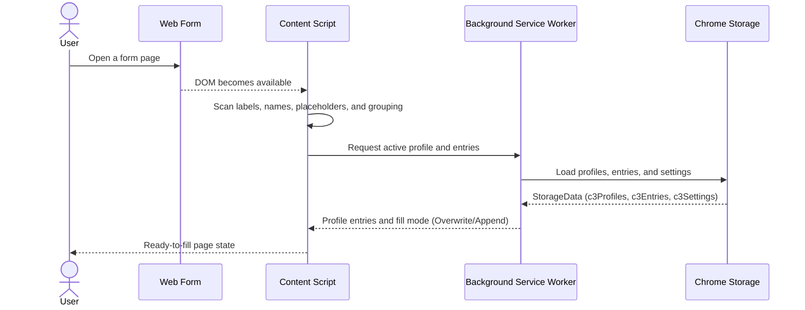
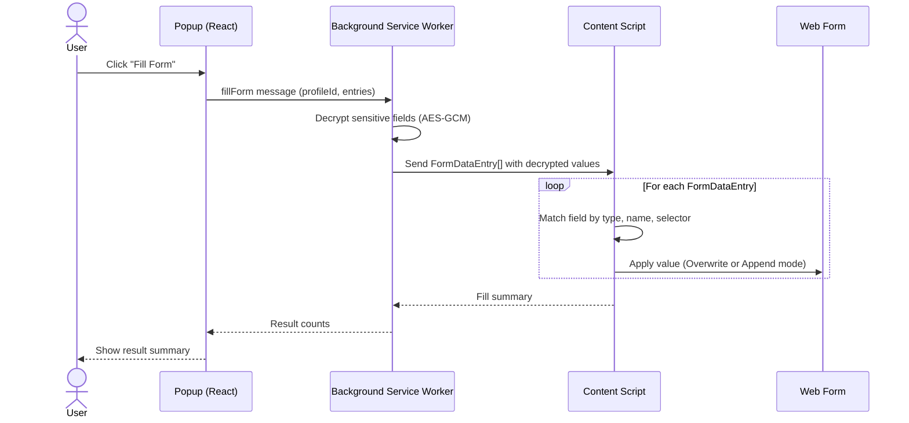
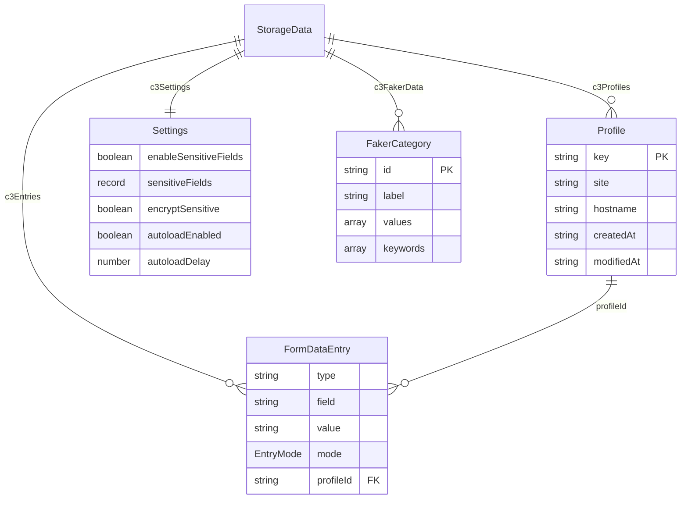
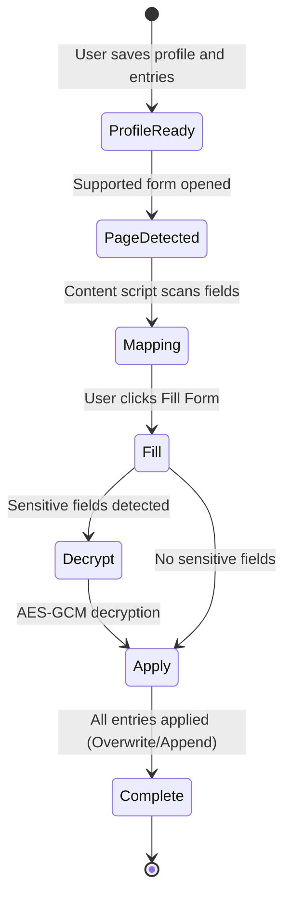

<div align="center">

# C3 Autofill - Data Flow Diagrams

**How profile data moves from local storage into live web forms**

</div>

---

## 1. Save or Update a Profile

```mermaid
sequenceDiagram
    actor U as User
    participant OPT as Options (React)
    participant ST as Chrome Storage

    U->>OPT: Enter profile values and form entries
    OPT->>OPT: Validate with isValidProfile / isValidEntry
    OPT->>ST: saveProfiles() / saveEntries()
    ST-->>OPT: Stored successfully
    OPT-->>U: Updated profile ready for autofill
```

---

## 2. Detect Fields on a Web Page



---

## 3. Autofill a Form



---

## 4. Export User Data

```mermaid
sequenceDiagram
    actor U as User
    participant OPT as Options (React)
    participant ST as Chrome Storage

    U->>OPT: Click "Export" in Advanced tab
    OPT->>ST: loadAllData()
    ST-->>OPT: StorageData snapshot
    OPT->>OPT: Serialize to JSON
    OPT-->>U: Download backup file
```

---

## 5. Import User Data

```mermaid
sequenceDiagram
    actor U as User
    participant OPT as Options (React)
    participant ST as Chrome Storage

    U->>OPT: Select a JSON backup file
    OPT->>OPT: Parse and validate structure
    OPT->>ST: importData() — merge into storage
    ST-->>OPT: Import complete
    OPT-->>U: Profiles and entries restored
```

---

## 6. Encryption Flow

```mermaid
sequenceDiagram
    participant OPT as Options (React)
    participant CRYPTO as helper.ts (Web Crypto API)
    participant ST as Chrome Storage

    Note over OPT,ST: Saving a sensitive field
    OPT->>CRYPTO: encryptValue(value, cryptoKey)
    CRYPTO->>CRYPTO: AES-GCM encrypt with random IV
    CRYPTO-->>OPT: Base64 encoded ciphertext
    OPT->>ST: Store encrypted value

    Note over OPT,ST: Reading a sensitive field
    ST-->>OPT: Encrypted value
    OPT->>CRYPTO: decryptValue(ciphertext, cryptoKey)
    CRYPTO->>CRYPTO: AES-GCM decrypt
    CRYPTO-->>OPT: Plaintext value
```

---

## Data Storage Model



---

## Autofill Workflow



---

<div align="center">

[Back to Organization Profile](../../profile/README.md)

</div>
