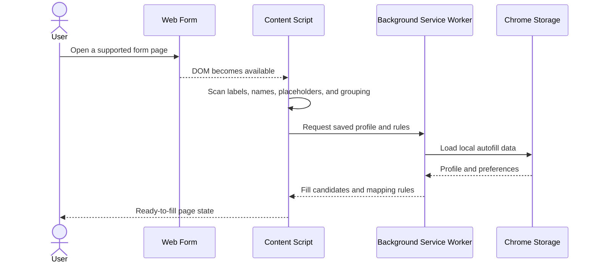
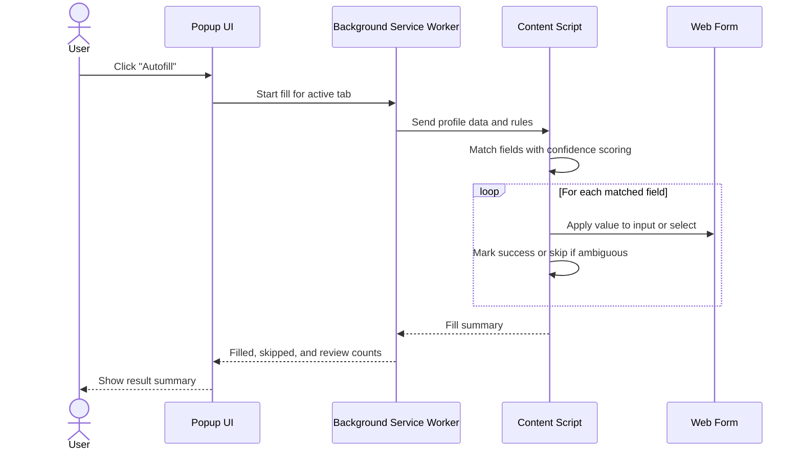
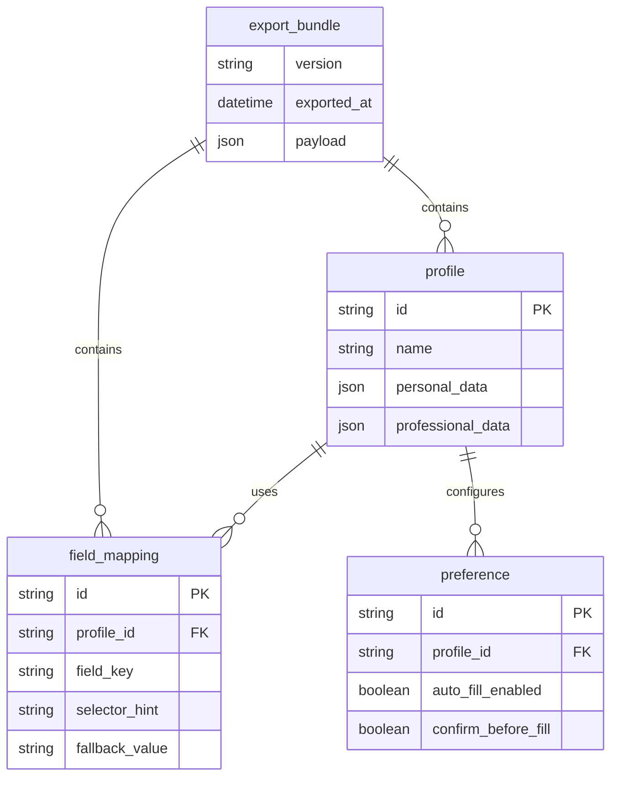
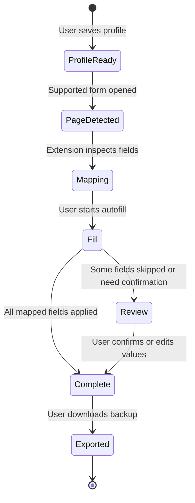

<div align="center">

# C3 Autofill - Data Flow Diagrams

**How profile data moves from local storage into live web forms**

</div>

---

## 1. Save or Update a Profile

```mermaid
sequenceDiagram
    actor U as User
    participant OPT as Options Dashboard
    participant BG as Background Service Worker
    participant ST as Chrome Storage

    U->>OPT: Enter profile values and preferences
    OPT->>BG: Save profile payload
    BG->>ST: Persist profile and settings
    ST-->>BG: Stored successfully
    BG-->>OPT: Save confirmation
    OPT-->>U: Updated profile ready for autofill
```

---

## 2. Detect Fields on a Web Page



---

## 3. Autofill a Form



---

## 4. Export User Data

```mermaid
sequenceDiagram
    actor U as User
    participant OPT as Options Dashboard
    participant BG as Background Service Worker
    participant ST as Chrome Storage

    U->>OPT: Click "Export JSON"
    OPT->>BG: Request export payload
    BG->>ST: Read profiles, rules, and settings
    ST-->>BG: Local data snapshot
    BG-->>OPT: Structured JSON payload
    OPT-->>U: Download backup file
```

---

## 5. Import User Data

```mermaid
sequenceDiagram
    actor U as User
    participant OPT as Options Dashboard
    participant BG as Background Service Worker
    participant ST as Chrome Storage

    U->>OPT: Select an exported JSON file
    OPT->>OPT: Validate file structure
    OPT->>BG: Submit import payload
    BG->>ST: Replace or merge local records
    ST-->>BG: Import saved
    BG-->>OPT: Import status
    OPT-->>U: Profiles and rules restored
```

---

## Data Storage Summary



---

## Autofill Workflow



---

<div align="center">

[Back to Organization Profile](../../profile/README.md)

</div>
