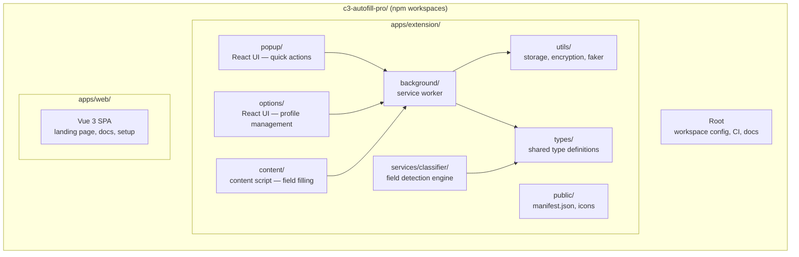

<div align="center">

# C3 Autofill - Project Structure

**Monorepo layout for the Chrome extension and marketing website**

</div>

---

## Repository Layout



---

## Directory Tree

```text
c3-autofill-pro/
|-- package.json                          # Workspace root (npm workspaces)
|-- tsconfig.json                         # Root TypeScript project references
|-- .github/workflows/
|   `-- release.yml                       # Chrome Web Store deploy pipeline
|
|-- apps/
|   |-- extension/                        # Chrome Extension
|   |   |-- package.json                  # Extension dependencies and scripts
|   |   |-- tsconfig.json                 # TS project references (app + node)
|   |   |-- tsconfig.app.json            # App TypeScript config (React JSX)
|   |   |-- tsconfig.node.json           # Node/Vite TypeScript config
|   |   |-- vite.config.ts               # Multi-entry build (popup, options, background)
|   |   |-- vite.content.config.ts       # Separate content script build
|   |   |-- eslint.config.js             # ESLint flat config (React + TS)
|   |   |
|   |   |-- public/
|   |   |   |-- manifest.json            # Chrome Manifest V3
|   |   |   `-- icons/                   # Extension icons (16, 48, 128, 256)
|   |   |
|   |   `-- src/
|   |       |-- background/
|   |       |   `-- index.ts             # Service worker (messaging, profile management)
|   |       |
|   |       |-- content/
|   |       |   `-- content.ts           # Content script (DOM scanning, field filling)
|   |       |
|   |       |-- popup/
|   |       |   |-- index.html           # Popup entry point
|   |       |   |-- index.tsx            # React root
|   |       |   |-- Popup.tsx            # Main popup component
|   |       |   |-- types.ts            # Popup-specific types
|   |       |   |-- hooks/
|   |       |   |   `-- useProfiles.ts   # Profile management hook
|   |       |   `-- components/
|   |       |       |-- ActionButton.tsx
|   |       |       |-- GenerateKeyForm.tsx
|   |       |       |-- Header.tsx
|   |       |       |-- KeyItem.tsx
|   |       |       |-- KeysList.tsx
|   |       |       |-- SearchBar.tsx
|   |       |       `-- SiteInfo.tsx
|   |       |
|   |       |-- options/
|   |       |   |-- index.html           # Options page entry point
|   |       |   |-- index.tsx            # React root
|   |       |   |-- Options.tsx          # Main options component
|   |       |   `-- components/
|   |       |       |-- AddProfileModal.tsx
|   |       |       |-- AdvancedTab.tsx
|   |       |       |-- CategoryEditModal.tsx
|   |       |       |-- DeleteConfirmModal.tsx
|   |       |       |-- EntriesTab.tsx
|   |       |       |-- EntryTable.tsx
|   |       |       |-- FakeDataTab.tsx
|   |       |       |-- ProfileEditModal.tsx
|   |       |       |-- ProfileSidebar.tsx
|   |       |       `-- SettingsTab.tsx
|   |       |
|   |       |-- services/
|   |       |   `-- classifier/
|   |       |       |-- ClassifierFactory.ts   # Factory for classifier strategies
|   |       |       |-- HeuristicClassifier.ts # DOM-based field classification
|   |       |       |-- MLClassifier.ts        # ML classifier (future)
|   |       |       `-- types.ts               # Classifier interfaces
|   |       |
|   |       |-- types/
|   |       |   `-- index.ts             # Central type definitions and validation
|   |       |
|   |       |-- utils/
|   |       |   |-- storage.ts           # Chrome storage abstraction layer
|   |       |   |-- helper.ts            # AES-GCM encryption, crypto key management
|   |       |   |-- faker.ts             # Fake data generation for testing
|   |       |   `-- dateHelpers.ts       # Date formatting utilities
|   |       |
|   |       |-- scripts/
|   |       |   `-- patch-manifest.js    # Post-build manifest patching
|   |       |
|   |       `-- assets/
|   |           `-- icon.svg             # Extension icon source
|   |
|   `-- web/                              # Marketing Website
|       |-- package.json                  # Vue 3 + Pinia + Vue Router
|       |-- vite.config.ts               # Vite + Vue + Tailwind
|       |-- tsconfig.json                # TypeScript config
|       |-- index.html                   # SPA entry point
|       `-- src/
|           |-- App.vue                  # Root Vue component
|           |-- main.ts                  # Vue app bootstrap
|           |-- router/index.ts          # Vue Router configuration
|           |-- stores/counter.ts        # Pinia state management
|           |-- components/
|           |   |-- AppHeader.vue
|           |   `-- AppFooter.vue
|           `-- views/
|               |-- HomeView.vue
|               |-- HowItWorksView.vue
|               |-- SetupView.vue
|               |-- SampleCheck.vue
|               |-- ReleaseNotes.vue
|               |-- PrivacyPolicy.vue
|               |-- TermsAndConditions.vue
|               `-- ContactUs.vue
```

---

## Module Responsibilities

| Module | Responsibility |
| :--- | :--- |
| **popup/** | Trigger autofill, search keys, show site info and active profile |
| **options/** | Manage profiles, form entries, faker categories, settings, import/export |
| **content/** | Scan page DOM for fillable fields and apply profile values |
| **background/** | Route messages between popup/options/content, manage storage access |
| **services/classifier/** | Detect and classify form field types using heuristic analysis |
| **types/** | Central type definitions, enums, validation helpers, message types |
| **utils/storage** | Chrome storage abstraction (load, save, clear, import/export) |
| **utils/helper** | AES-GCM encryption/decryption, crypto key management, sensitive field detection |
| **utils/faker** | Generate fake test data from configurable categories |
| **utils/dateHelpers** | Date formatting and manipulation utilities |
| **scripts/patch-manifest** | Post-build step to patch hashed filenames into manifest.json |
| **apps/web** | Public-facing marketing site with setup guide, docs, and sample form |

---

## Build and Distribution

| Target | Build Tool | Config | Output | Distribution |
| :--- | :--- | :--- | :--- | :--- |
| **Popup + Options + Background** | Vite 6 | `vite.config.ts` | `dist/` | Chrome Web Store |
| **Content Script** | Vite 6 | `vite.content.config.ts` | `dist/assets/content.js` | Bundled with extension |
| **Manifest Patching** | Node script | `patch-manifest.js` | `dist/manifest.json` | Resolves hashed filenames |
| **Marketing Site** | Vite 6 | `apps/web/vite.config.ts` | `apps/web/dist/` | Web hosting |

---

## Workspace Scripts

| Command | Description |
| :--- | :--- |
| `npm run dev` | Start extension dev server |
| `npm run dev:web` | Start marketing site dev server |
| `npm run build` | Build extension for production |
| `npm run build:web` | Build marketing site |
| `npm run build:all` | Build all workspaces |
| `npm run lint` | Lint all workspaces |

---

<div align="center">

[Back to Organization Profile](../../profile/README.md)

</div>
