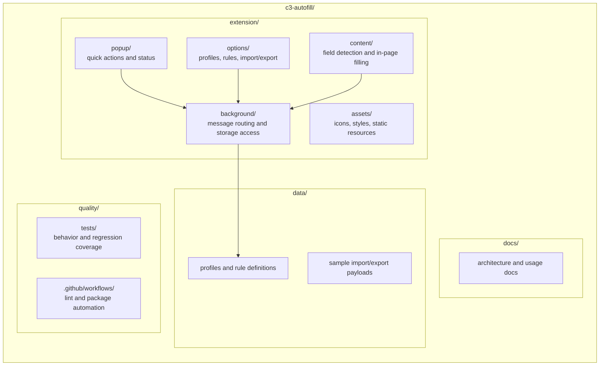

<div align="center">

# C3 Autofill - Project Structure

**A documentation map for the extension-focused repository layout**

</div>

---

## Repository Layout



---

## Directory Tree

```text
c3-autofill/
|-- extension/
|   |-- manifest.json             # Manifest V3 configuration
|   |-- popup.html / popup.js     # Quick autofill actions
|   |-- options.html / options.js # Profile and settings management
|   |-- content.js                # Page inspection and field filling
|   |-- background.js             # Service worker coordination
|   |-- styles/                   # Shared extension styles
|   `-- icons/                    # Browser action and store assets
|
|-- data/
|   |-- profiles.json             # Saved profile structure reference
|   `-- export-schema.json        # Import/export payload contract
|
|-- docs/
|   |-- ARCHITECTURE.md           # System overview and responsibilities
|   |-- STRUCTURE.md              # Repository and folder map
|   `-- DATA_FLOW.md              # Core user workflow diagrams
|
|-- tests/
|   |-- unit/                     # Autofill logic and mapping tests
|   `-- e2e/                      # Browser interaction coverage
|
|-- scripts/
|   |-- build-extension.mjs       # Package extension artifacts
|   `-- validate-export.mjs       # Check import/export payloads
|
|-- .github/workflows/
|   |-- ci.yml                    # Lint and test checks
|   `-- release.yml               # Store packaging and release flow
|
`-- README.md                     # Project overview and setup
```

---

## Module Responsibilities

| Module | Responsibility |
| :--- | :--- |
| **Popup** | Trigger autofill and show current-page status |
| **Options** | Manage user profiles, rules, and settings |
| **Content Script** | Discover fields and apply values in the page |
| **Background** | Coordinate messaging and persistent state access |
| **Data Contracts** | Keep import/export payloads predictable |
| **Tests** | Catch selector drift and autofill regressions |

---

## Build and Distribution

| Target | Build Tool | Output | Distribution |
| :--- | :--- | :--- | :--- |
| **Browser Extension** | Packaging script | `.zip` extension bundle | Chrome Web Store, GitHub Releases |
| **Data Export** | Built-in JSON export | `.json` backup files | Local user backup |

---

<div align="center">

[Back to Organization Profile](../../profile/README.md)

</div>
