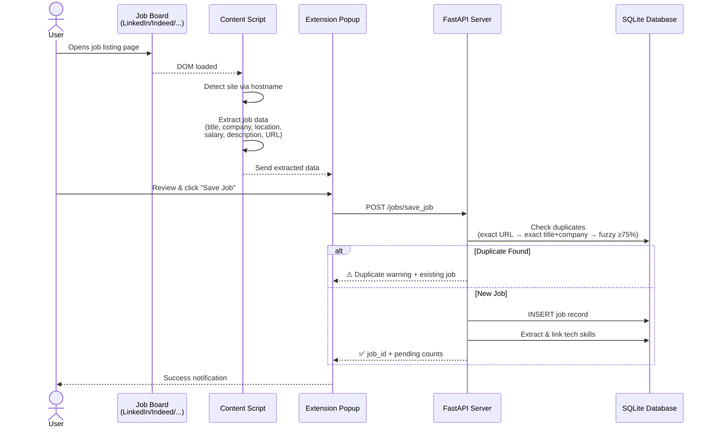
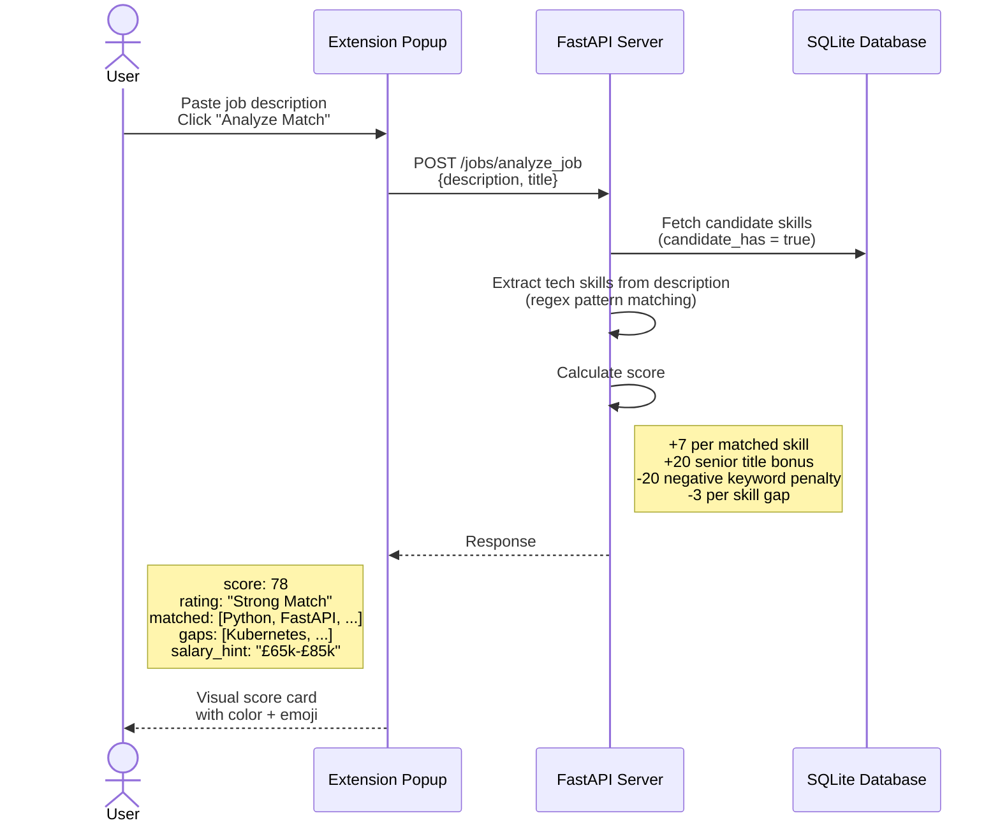
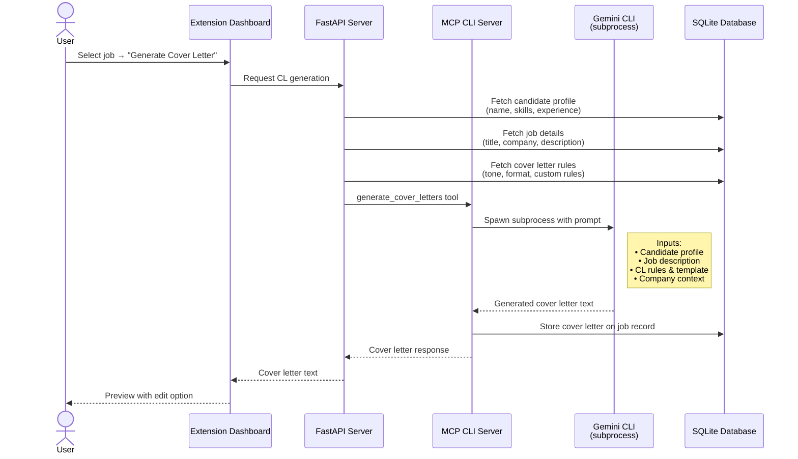
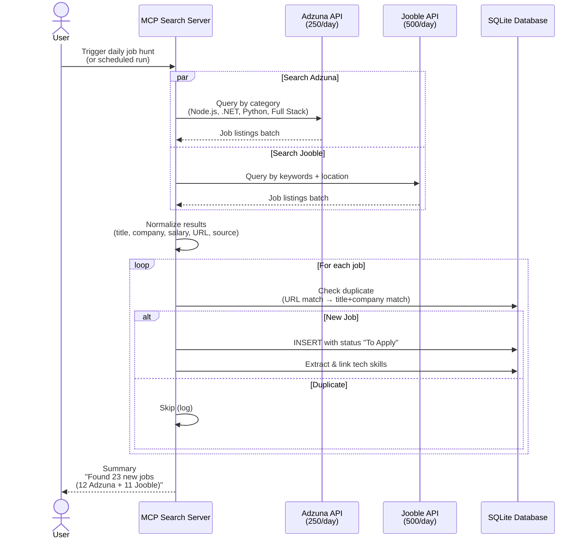
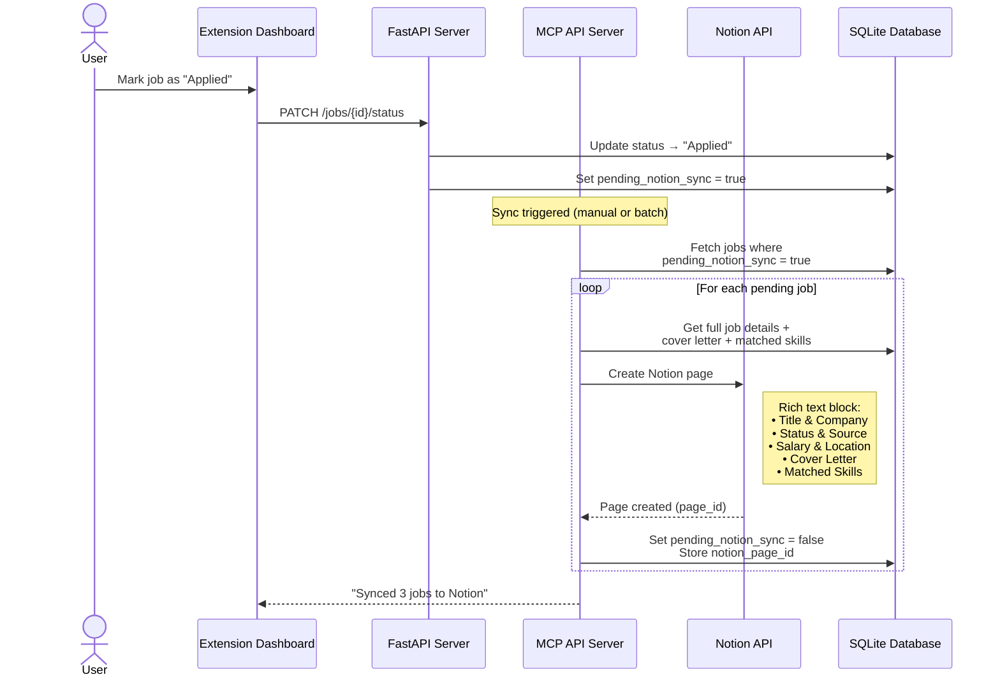
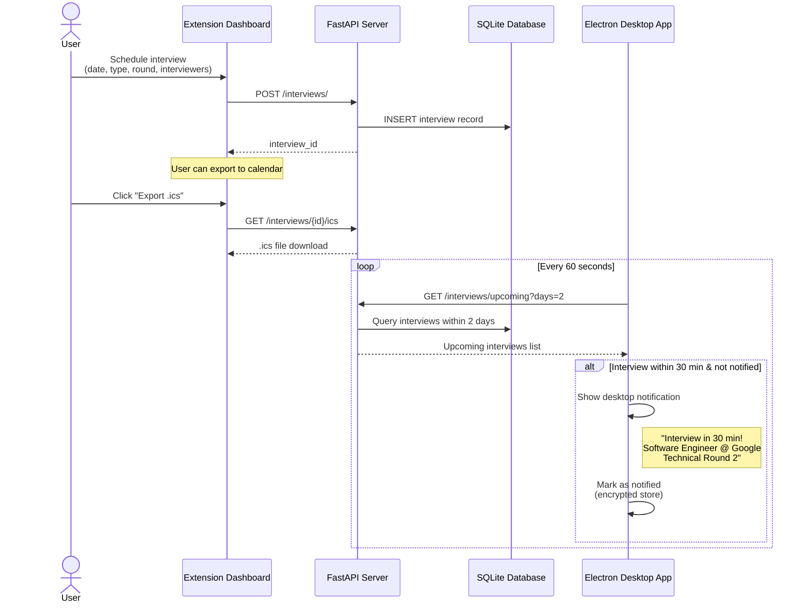
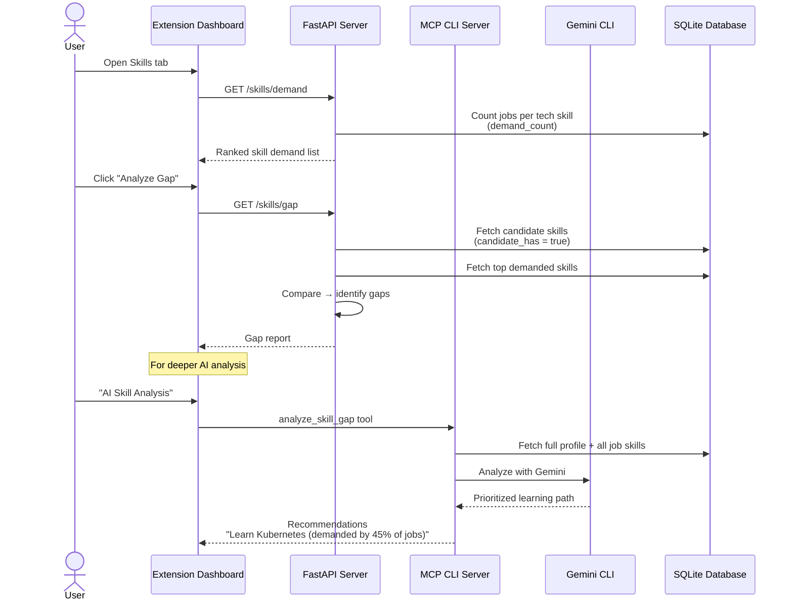
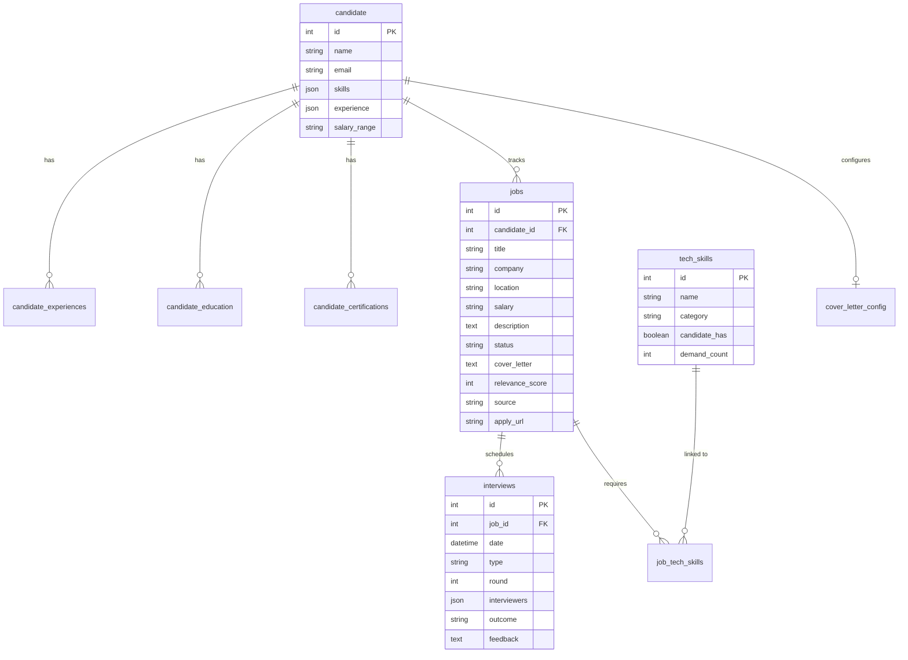
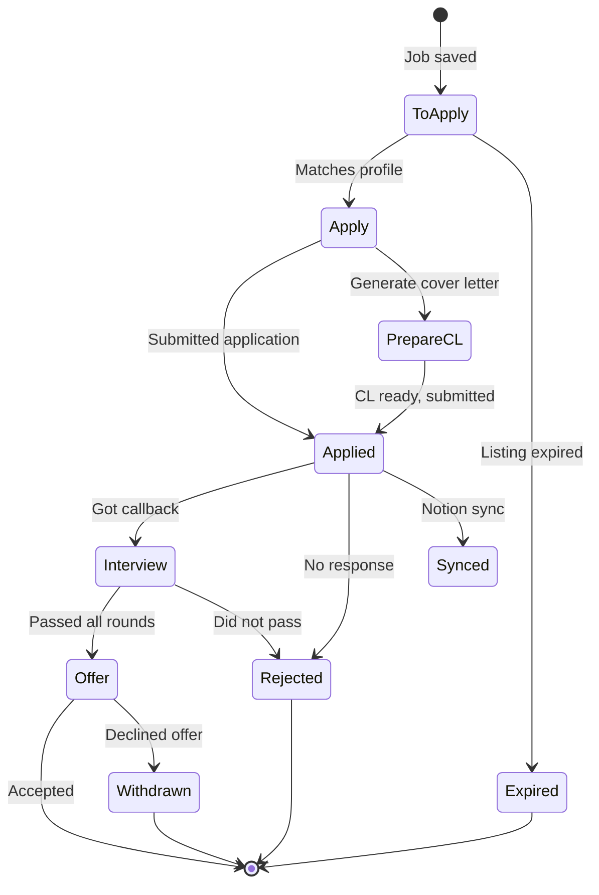

# Job Compass — Data Flow Diagrams

**How data moves through the system across key workflows**

---

## 1. Save Job from Job Board

---

## 2. AI Job Match Analysis

---

## 3. Cover Letter Generation

---

## 4. Automated Daily Job Search

---

## 5. Notion Sync

---

## 6. Interview Pipeline & Reminders

---

## 7. Skills Demand & Gap Analysis

---

## Data Storage Summary

### Status Workflow

---

[Back to Organization Profile](../../profile/README.md)

