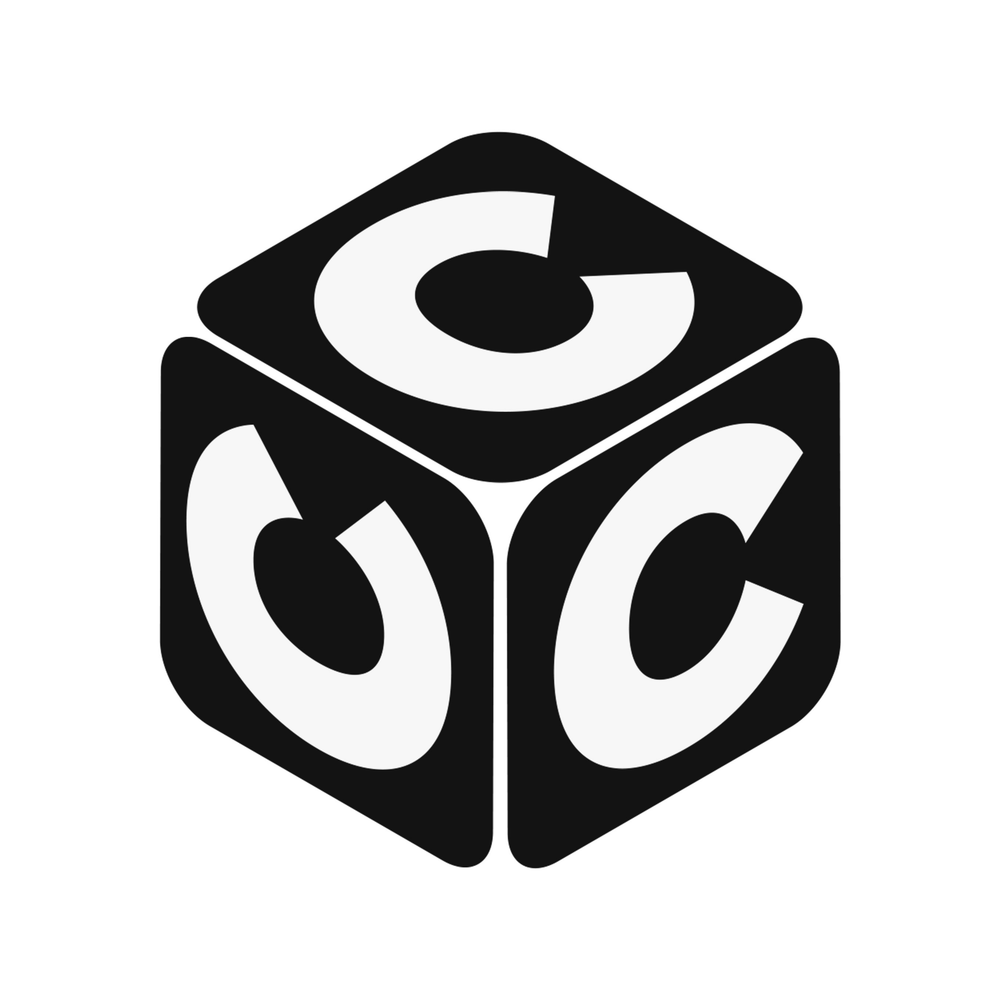

  

  # Welcome to CodeCanvas Collective 🎨

  **Empowering Innovation Through Code, Creativity, and Community.**

  
  
  <!--  -->
  

---

## 🙋‍♀️ About Us
At **CodeCanvas Collective**, we bridge the gap between imagination and implementation. We are an open-source startup dedicated to building tools that developers love and users rely on.

Our mission is to provide:
* 🖥 **Dynamic Solutions** for modern web challenges.
* 🎨 **Creative Designs** that prioritize user experience (UX).
* 🤖 **AI-Driven Tools** that automate the boring stuff.

---

## 🚀 Flagship Project: C3 Autofill

> *Stop typing. Start doing.*

**C3 Autofill** is our premier Chrome extension designed to intelligently manage and autofill web forms using local AI logic.

| Feature | Description |
| :--- | :--- |
| ⚡ **Speed** | Instant form filling across complex websites. |
| 🔐 **Security** | Encrypted local storage. Your data never leaves your device. |
| 🧠 **Smart Logic** | AI-driven field recognition that learns as you browse. |
| 🛠️ **Developer Ready** | Full JSON import/export for power users. |

**Tech:** Chrome MV3 · JavaScript · Content Scripts · Local Storage · JSON Import/Export

📐 [**Architecture**](../FLAGSHIP_PROJECT/c3-autofill/ARCHITECTURE.md) · 📁 [**Project Structure**](../FLAGSHIP_PROJECT/c3-autofill/STRUCTURE.md) · 🔀 [**Data Flow Diagrams**](../FLAGSHIP_PROJECT/c3-autofill/DATA_FLOW.md)

  
  
  

---

## 🧭 Job Compass — AI-Powered Job Hunt Platform

> *Your intelligent companion for the modern job search.*

**Job Compass** is a full-stack, cross-platform job hunting toolkit — a polyglot monorepo combining a **Chrome Extension**, **Electron Desktop App**, **FastAPI Backend**, and **AI-powered MCP Servers**.

| Feature | Description |
| :--- | :--- |
| 🔍 **Smart Extraction** | Auto-captures jobs from 12+ platforms (LinkedIn, Indeed, Glassdoor, Seek...) |
| 🤖 **AI Scoring** | Gemini-powered skill matching, gap analysis, and relevance scoring |
| ✉️ **Cover Letters** | AI-generated with company research and custom rules |
| 🗓️ **Interview Pipeline** | Schedule, track rounds, export .ics, desktop reminders |
| 📓 **Notion Sync** | Push applied jobs to Notion with rich metadata |
| 🔎 **Job Search** | Automated daily search via Adzuna & Jooble APIs |

**Tech:** Python 3.13 · FastAPI · Electron · Chrome MV3 · Gemini AI · MCP · SQLite · Turborepo · pnpm + uv · GitHub Actions

📐 [**Architecture**](../FLAGSHIP_PROJECT/job-compass/ARCHITECTURE.md) · 📁 [**Project Structure**](../FLAGSHIP_PROJECT/job-compass/STRUCTURE.md) · 🔀 [**Data Flow Diagrams**](../FLAGSHIP_PROJECT/job-compass/DATA_FLOW.md)

  
  

---

## 🤝 Community & Governance
We are a transparency-first organization. We operate openly and invite you to join us.

* 📜 **[Code of Conduct](https://github.com/CodeCanvasCollective/.github/blob/main/CODE_OF_CONDUCT.md):** Our pledge to keep this community safe.
* ⚖️ **[Governance Model](https://github.com/CodeCanvasCollective/.github/blob/main/GOVERNANCE.md):** How we make decisions and how *you* can become a maintainer.
* 🗺️ **[Public Roadmap](https://github.com/orgs/CodeCanvasCollective/projects/1):** See what we are building next.

### How to Contribute
We believe in the power of collaboration!
1.  **[Read the Guide](https://github.com/CodeCanvasCollective/.github/blob/main/CONTRIBUTING.md):** Step-by-step instructions for your first Pull Request.
2.  **Find an Issue:** Look for the `good-first-issue` label on our repositories.
3.  **Spread Knowledge:** Share tutorials or blog posts about our tools.

---

## 💖 Support Us
We are a free and open-source organization. If our tools save you time, please consider supporting our infrastructure costs.

<!--  -->

---

**[CodeCanvasCollective.com](https://codecanvascollective.com)**
 
*Let’s build something amazing, together.*

