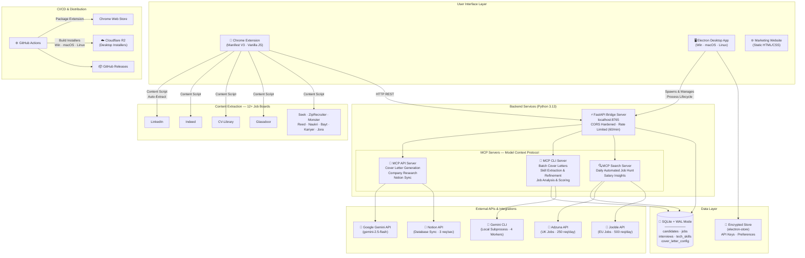

# Job Compass — System Architecture

**A polyglot monorepo powering an AI-driven job hunt platform**

---

## High-Level Architecture

---

## Component Breakdown

### 1. Chrome Extension (Manifest V3)

| Aspect | Detail |
| :--- | :--- |
| **Popup** | Job save & match analysis UI |
| **Content Scripts** | Auto-extract job data from 12+ platforms |
| **Options Dashboard** | 8-tab dashboard (Jobs, Skills, Cover Letters, Interviews, Profile, MCP, Settings) |
| **Background** | Service worker for message routing |
| **Charts** | Chart.js v4.5.1 (CSP-compliant local bundle) |
| **Storage** | Chrome Storage API (local) |

### 2. Electron Desktop App

| Aspect | Detail |
| :--- | :--- |
| **Runtime** | Electron 40.6.1 |
| **Server Manager** | Spawns FastAPI backend, health checks, environment setup |
| **System Tray** | Background operation with tray icon |
| **Auto-Update** | Built-in update mechanism |
| **Security** | IPC preload bridge, encrypted config store |
| **Build Targets** | Windows (NSIS), macOS (DMG arm64 + x64), Linux (AppImage) |

### 3. FastAPI Bridge Server

| Aspect | Detail |
| :--- | :--- |
| **Framework** | FastAPI 0.115 + Uvicorn (async) |
| **Port** | 8765 (localhost) |
| **Routers** | Jobs, Skills, Interviews, Stats, Settings, API Keys, Health |
| **Security** | CORS hardened (localhost + chrome-extension origins only), rate limiting (60/min) |
| **Features** | Duplicate detection (fuzzy + exact), PDF generation, ICS export |

### 4. MCP Servers (Model Context Protocol)

| Server | Tools | External API |
| :--- | :--- | :--- |
| **MCP API** | `generate_cover_letter`, `research_company`, `sync_to_notion`, `check_status` | Gemini API, Notion |
| **MCP CLI** | `refine_job_tech_skills`, `analyze_and_decide`, `generate_cover_letters` (batch), `analyze_skill_gap` | Gemini CLI (subprocess, 4 workers) |
| **MCP Search** | `search_run_daily_job_hunt`, `search_find_matching_jobs`, `search_salary_insights` | Adzuna, Jooble |

---

## Tech Stack

| Layer | Technologies |
| :--- | :--- |
| **Frontend** | Chrome Extension (MV3), Vanilla JS, Chart.js |
| **Desktop** | Electron 40, electron-builder |
| **Backend** | Python 3.13, FastAPI, Uvicorn |
| **AI/ML** | Google Gemini API, Model Context Protocol (MCP) |
| **Database** | SQLite (WAL mode), Encrypted electron-store |
| **Job APIs** | Adzuna, Jooble |
| **Integrations** | Notion API, ICS calendar export |
| **Monorepo** | pnpm + uv workspaces, Turborepo 2.4 |
| **CI/CD** | GitHub Actions, Cloudflare R2 |
| **Testing** | pytest, Playwright E2E |
| **Platforms** | Windows, macOS (Intel + ARM), Linux, Chromium browsers |

---

## Security Model

- **API Keys** — Encrypted at rest via `cryptography` + electron-store
- **CORS** — Hardened origins (localhost, chrome-extension://, job board domains only)
- **Rate Limiting** — 60 requests/minute via slowapi
- **Content Security Policy** — Extension CSP with no inline scripts
- **IPC** — Electron preload bridge (no direct Node.js access from renderer)
- **Data Privacy** — All data stored locally (SQLite), no cloud telemetry

---

[Back to Organization Profile](../README.md)

