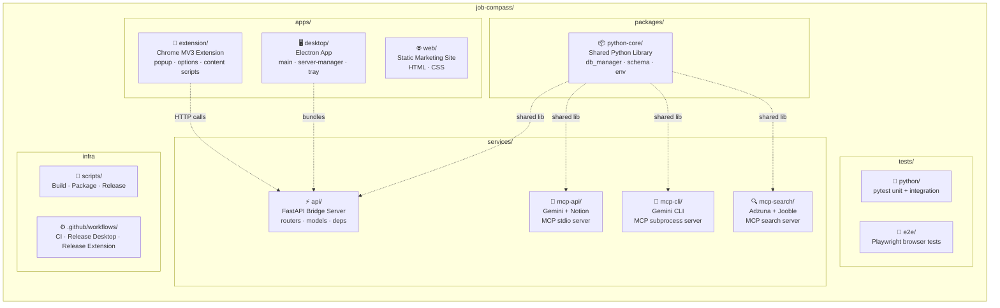
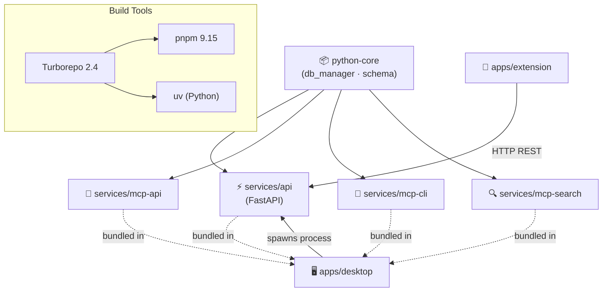

<div align="center">

# Job Compass — Monorepo Structure

**pnpm + uv hybrid workspace managed by Turborepo**

</div>

---

## Repository Layout



---

## Directory Tree

```
job-compass/
├── apps/
│   ├── extension/                  # Chrome Extension (Manifest V3)
│   │   ├── manifest.json           # MV3 config, permissions, content scripts
│   │   ├── popup.html / popup.js   # Job save & analysis popup
│   │   ├── options.html / options.js # 8-tab dashboard
│   │   ├── content.js              # Auto-extract from job boards
│   │   ├── background.js           # Service worker message router
│   │   ├── chart.js                # Chart.js v4.5.1 (local CSP bundle)
│   │   └── icons/                  # Extension icons (16–128px)
│   │
│   ├── desktop/                    # Electron Desktop App
│   │   ├── main.js                 # App lifecycle, window management
│   │   ├── server-manager.js       # FastAPI process spawn & health checks
│   │   ├── tray.js                 # System tray integration
│   │   ├── updater.js              # Auto-update mechanism
│   │   ├── preload.js              # IPC security bridge
│   │   ├── paths.js                # Platform-aware path resolution
│   │   └── package.json            # electron-builder config
│   │
│   └── web/                        # Marketing Landing Page
│       ├── index.html              # Static site
│       ├── sitemap.xml             # SEO
│       └── robots.txt              # Crawl rules
│
├── packages/
│   └── python-core/                # Shared Python Library
│       └── src/job_compass_core/
│           ├── db_manager.py       # SQLite CRUD, duplicate detection, skill extraction
│           ├── schema.sql          # Database DDL (tables, indexes, triggers)
│           ├── env.py              # Path resolution (repo root, data dir)
│           └── logging_config.py   # Structured logging setup
│
├── services/
│   ├── api/                        # FastAPI Bridge Server
│   │   └── src/job_compass_api/
│   │       ├── app.py              # Factory, CORS, lifespan, rate limiting
│   │       ├── models.py           # Pydantic request/response schemas
│   │       ├── dependencies.py     # DI: db_manager, skill helpers
│   │       ├── bridge_server.py    # Uvicorn entry point
│   │       └── routers/
│   │           ├── jobs.py         # Save, analyze, duplicate check, CRUD
│   │           ├── skills.py       # Demand & gap analysis
│   │           ├── interviews.py   # Interview CRUD, ICS export
│   │           ├── stats.py        # Dashboard aggregates
│   │           ├── settings.py     # Profile & cover letter config
│   │           ├── api_keys.py     # Encrypted key storage
│   │           └── health.py       # Health check, pending counts
│   │
│   ├── mcp-api/                    # MCP Server — Gemini API + Notion
│   │   └── src/job_compass_mcp_api/
│   │       └── job_hunt_api_server.py
│   │
│   ├── mcp-cli/                    # MCP Server — Gemini CLI Subprocess
│   │   └── src/job_compass_mcp_cli/
│   │       └── job_hunt_cli_server.py
│   │
│   └── mcp-search/                 # MCP Server — Job Search APIs
│       └── src/job_compass_mcp_search/
│           └── job_hunt_search_server.py
│
├── tests/
│   ├── python/                     # pytest (unit + integration + security)
│   └── e2e/                        # Playwright (extension onboarding flow)
│
├── scripts/
│   ├── stage-extension.mjs         # Copy source → dist/unpacked/
│   ├── package-extension.mjs       # Zip → job-compass-extension.zip
│   └── ...                         # Build & release orchestration
│
├── .github/workflows/
│   ├── ci.yml                      # Lint + test on push/PR
│   ├── release-desktop.yml         # Matrix build → R2 + GitHub Releases
│   └── release-extension.yml       # Package → Chrome Web Store
│
├── turbo.json                      # Turborepo task pipeline
├── pnpm-workspace.yaml             # Node workspace packages
├── pyproject.toml                  # uv Python workspace
└── .env                            # API keys (git-ignored)
```

---

## Package Dependencies



---

## Build & Distribution

| Target | Build Tool | Output | Distribution |
| :--- | :--- | :--- | :--- |
| **Chrome Extension** | Custom staging scripts | `dist/job-compass-extension.zip` | Chrome Web Store, GitHub Releases |
| **Windows Desktop** | electron-builder (NSIS) | `.exe` installer | Cloudflare R2, GitHub Releases |
| **macOS Desktop** | electron-builder (DMG) | `.dmg` (arm64 + x64) | Cloudflare R2, GitHub Releases |
| **Linux Desktop** | electron-builder (AppImage) | `.AppImage` | Cloudflare R2, GitHub Releases |
| **Python Packages** | Hatchling | Wheels | uv workspace (local) |

---

<div align="center">

[Back to Organization Profile](../README.md)

</div>
